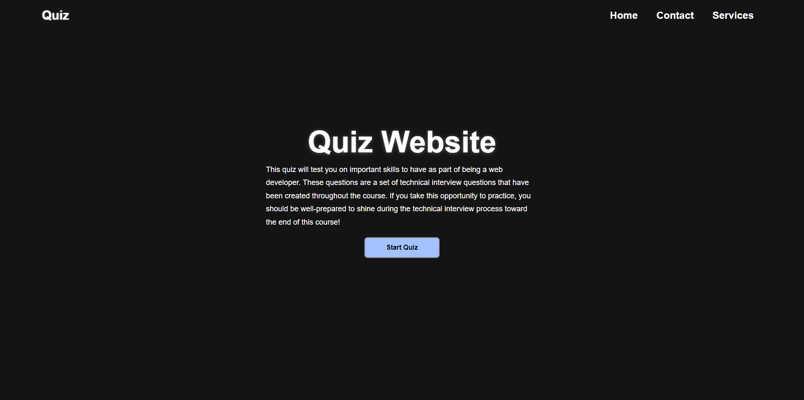

# 04 Web-APIs: Quiz

## Description

For this weeks challenge, the assignment was to make a Quiz webpage using HTML, CSS, and JavaScript. I watched some tutorials from two different people; but the JavaScript was mostly written with the help from the first link:
https://www.youtube.com/watch?v=riDzcEQbX6k&t=3s&ab_channel=WebDevSimplified
https://www.youtube.com/watch?v=Vp8x8-reqZA&list=LL&index=6&ab_channel=Codehal

## Usage

To use this, go to https://joshhill1.github.io/04Challenge/
and you should be able to see something like this:
